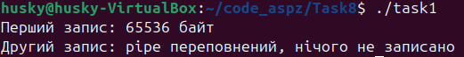
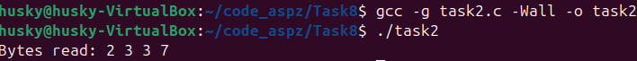
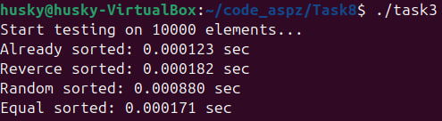
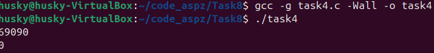
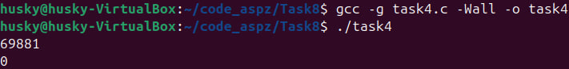
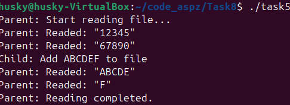

# PR8

## Завдання 8.1
### Чи може write() повертати неповну к-сть байтів після запису у якийсь файловий дискриптор?
### Так, це абсолютно реально з тієї причини, що ресурс не завжди може прийняти всі 100% даних, і через це повертаються лише та к-сть даних, яка змогла записатися.
### Ось наочний приклад:
```
```
### В цьому коді, після переповнення pipe, відповідно, нічого записати далі не можемо


## Завдання 8.2
### Одразу дам відповідь на питання: після переміщення покажчика на 3 позиції вперед та зчитування 4 байтів, ми отримаємо у записі 4, 5, 6 та 7 комірки нашого масиву
### Наведемо приклад в коді:
```

```
### І покажемо ті комірки, які ми зчитали з файлу після lseek():


## Завдання 8.3
### Тут для перевірки найгіршого випадку розташування елементів для швидкого сортування, у коді я обрав 4 випадки:<br>1)Вже відсортований <br>2)Зворотньо відсортований <br>3)Випадкове розташування <br>4)Рівні значення 
### Поглянемо на мій код:
```

```
### І нарешті результати:


## Завдання 8.4
### В цьому завданні треба трошки розібратися, що у нас виводить fork().
### При створенні дочірнього процесу за допомогою fork(), функція може повертати негативні значення (якщо створення дочірнього процесу було з помилкою), нуль, якщо це новостворений дочірній процес, або більше нуля - це значення pid дочірнього процесу, яке повертає батьківський при створенні.
### Виконаємо початковий код:
```
#include <stdio.h>
#include <unistd.h>

int main() {
    int pid;
    pid = fork();
    printf("%d\n", pid);
}
```
### І отримаємо результат:


### Спочатку йде pid дочірнього процесу від батьківського, а потім вже йде надсилання pid від самого дочірнього процесу
### Після цього, додамо трошки перевірок та вдосконалимо код:
```

```
### І отримаємо аналогічний результат:


## Завдання 8.5 (12 варіант)
### Завданням було створити програму, яка симулює часткове зчитування з фалу з паралельнимзаписом з іншого процесу.
### Реалізував я це через fork() і для визначення процесу я просто поставив умову на pid, що кожен pid (батьківський і дочірній) виконують свою функцію:
```
```

